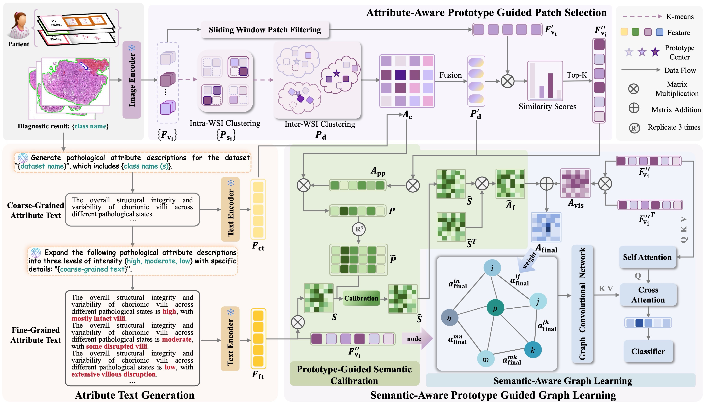

# ProtoSG-Net
Non-Parametric Prototypes Enable Semantic Graph Learning for Whole-Slide Pathology, **MICCAI2026**
 
Zixuan Gao, Qing Zhang, Hang Guo, Yan Wang, and Qingli Li
 


## 1. Preprocessing
### 1.1 Data Preparation
WSIs are preprocessed using [CLAM](https://github.com/mahmoodlab/CLAM) with a patch size of 512 × 512. Patch features are then extracted using [UNI](https://github.com/mahmoodlab/UNI).

### 1.2 Sliding Window Patch Filtering
```bash
python ./preprocess/2Dcom.py
```

### 1.3 Prototypes Generation
Perform two-stage clustering to obtain prototypes.
```bash
python ./preprocess/intra_WSI.py
```
```bash
python ./preprocess/inter_WSI.py
```
